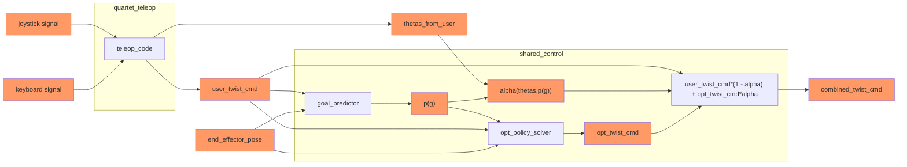

This is a public copy of a private repo in the HARPLab Github. I'm making a public copy since I'm applying for internships. Cut me some slack y'all, practically all my code is in private repos in different organizations' Github profiles.

Also, plz hire me <3


# Assistance Preference Pilot Study repo

This study code and the other repos listed in the [rosinstall file][study-rosinstall] were all developed and tested with ROS Noetic on Ubuntu 20.04. For instructions on how to install ROS Noetic and additional ROS packages used by this study code (i.e. ROS MoveIt and Gazebo packages), check out [this wiki page][ros-installation].


[ros-installation]: https://github.com/HARPLab/harp_arm_ros_pkgs/blob/main/wiki/setup_and_installation/System%20Setup.md
[study-rosinstall]: https://github.com/HARPLab/harplab-rosinstalls/blob/master/assist_pref_pilot_v1.rosinstall
[quartet-setup]: https://github.com/HARPLab/harpdocs/wiki/Quartet-(gen3-arm)
[joy-launch-file]: https://github.com/HARPLab/harp_arm_py/blob/pilot_study_v1/launch/teleop_interface.launch
[dev-joy-param]: https://github.com/HARPLab/harp_arm_py/blob/377b667a7f3a8b749bd9673bf97f17e8fd9efa8c/launch/teleop_interface.launch#L6
[arb-input-launch]: https://github.com/HARPLab/quartet_shared_control/blob/main/launch/arbitration_input_publisher.launch
[study-launch]: https://github.com/HARPLab/assist_pref_grasp_demo/blob/pilot_study_v1/launch/pilot_v1.launch

## Installation

These instructions assume you've already installed ROS Noetic, ROS's MoveIt package (i.e. `ros-noetic-moveit`), and ROS's Gazebo packages (i.e. `ros-noetic-gazebo-ros-pkgs` and `ros-noetic-gazebo-ros-control`) on your system. See [this page][ros-installation] if you haven't done that yet.


### Step 1: Install ros_kortex dependencies

The study code requires the `ros_kortex` repo which requires the conan package manager be installed and configured. The following commands will install and configure conan.


```bash
$ sudo apt install python3-pip
$ sudo python3 -m pip install conan
$ conan config set general.revisions_enabled=1
$ conan profile new default --detect > /dev/null
$ conan profile update settings.compiler.libcxx=libstdc++11 default
```

### Step 2: Install Python tools for ROS pkgs

If not already installed, install the Python tools for ROS tools like `rosinstall` files and `wstool`. (If you're not sure if you've installed these packages, just run the commands below as if you haven't installed them.)

```bash
$ sudo apt install python3-rosinstall python3-rosinstall-generator python3-wstool build-essential
$ sudo apt install python3-catkin-tools python3-osrf-pycommon
$ python3 -m pip install rospkg catkin_pkg
```

### Step 3: Clone harplab-rosinstalls repo

The rosinstall file that defines all the repos you need to run the study code is in the [`harplab-rosinstalls` repo](https://github.com/HARPLab/harplab-rosinstalls). Clone this repository into your home directory.

```bash
$ cd ~
$ git clone git@github.com:HARPLab/harplab-rosinstalls.git
```


### Step 3: Create a workspace

Now we can initialize a catkin workspace for our study code.

```bash
$ cd ~
$ mkdir -p ~/my_workspace/src
$ cd ~/my_workspace/src
$ catkin_init_workspace
$ wstool init
```

### Step 4: Update/clone all .rosinstall repos for this study

We first want to merge the [rosinstall file][study-rosinstall] for our study into the rosinstall file we initialized in the previous step. (Note that the rosinstall file we initialized in the previous step is here: `~/my_workspace/src/.rosinstall`.) The `wstool merge` command lets us do that, and the `wstool up` command will clone and update all the repos in the rosinstall file into the `src` directory of the workspace.

```bash
$ wstool merge ~/harplab-rosinstalls/assist_pref_pilot_v1.rosinstall
$ wstool up
```

### Step 5: Build the workspace

Now we want to build our catkin workspace by first installing any ROS dependencies specified in the `package.xml` file of each of the ROS packages in the `src` directory. This can be achieved with the `rosdep install` command shown below. Then, we can run `catkin build` at the top of our workspace to build all the packages cloned and/or updated by `wstool` in the previous step. Once the build is finished, source the workspace's `devel/setup.bash` file.

```bash
$ cd ~/my_workspace
$ source /opt/ros/noetic/setup.bash
$ rosdep install --from-paths src --ignore-src -y
$ catkin build # should take about 5 minutes to build
$ source devel/setup.bash
```

## Running Study Code

This code was developed and tested on Quartet, which is HARP Lab's Kinova Gen 3 robot arm. In the instructions below, we refer to the catkin workspace containing the study code as `~/my_workspace`.


### Step 1: Launch Robot Arm's Driver

<details>
    <summary>On real robot</summary>

#### Substep 1: Connect computer to robot and configure connection

If you haven't done so already, follow the steps outlined in [this wiki page][quartet-setup] to connect to Quartet and configure the connection between your computer and the robot.

#### Substep 2: Run Quartet's driver launch file

Open a new terminal (referred to in these instructions as `TERMINAL_1`), move to the top of your workspace (called `~/my_workspace` in these instructions), and source the workspace's `devel/setup.bash` file. Then run the command for launching the real robot's driver code

```bash
# In TERMINAL_1
$ cd ~/my_workspace
$ source devel/setup.bash
$ roslaunch quartet_launch default.launch
```

</details>


<details>
    <summary>In simulation</summary>


Open a new terminal (referred to in these instructions as `TERMINAL_1`), move to the top of your workspace (called `~/my_workspace` in these instructions), and source the workspace's `devel/setup.bash` file. Then run the command for launching the simulated robot's driver code

```bash
# In TERMINAL_1
$ cd ~/my_workspace
$ source devel/setup.bash
$ roslaunch quartet_launch sim_default.launch
```

</details>


### Step 2: Launch joystick node

Open a new terminal (referred to in these instructions as `TERMINAL_2`). Once sourcing the workspace's `devel/setup.bash` file, run the command for launching the joystick ROS node. (Note that this launch file is here: [`my_workspace/src/harp_arm_py/launch/teleop_interface.launch`][joy-launch-file].)

```bash
# In TERMINAL_2
$ cd ~/my_workspace
$ source devel/setup.bash
$ roslaunch harp_py teleop_interface.launch
```

<details>
    <summary>Testing</summary>


To test if this node is working, you can check the `/joy` topic to see if messages from the joystick (or other input interface) are being published. Use the following commands in a brand new terminal:

```bash
# In new terminal
$ cd ~/my_workspace
$ source devel/setup.bash
$ rostopic echo /joy
```
</details>

<details>
    <summary>Troubleshooting</summary>

If the joystick node fails to launch, make sure the `dev` param in the launch file [here][dev-joy-param] has the value associated with where you plugged the joystick in.
</details>

### Step 3: Launch assistance changing code

This is for the code that enables users to change the parameters associated with robot assistance.

Open a new terminal (referred to in these instructions as `TERMINAL_3`). Once sourcing the workspace's `devel/setup.bash` file, run the command for launching the arbitration input publishing code (found [here][arb-input-launch]).

```bash
# In TERMINAL_3
$ cd ~/my_workspace
$ source devel/setup.bash
$ roslaunch shared_control arbitration_input_publisher.launch
```

### Step 4: Launch the main study script

Open a new terminal (referred to in these instructions as `TERMINAL_4`). Once sourcing the workspace's `devel/setup.bash` file, run the command for launching the main study script (found [here][study-launch]).

```bash
# In TERMINAL_4
$ cd ~/my_workspace
$ source devel/setup.bash
$ roslaunch assist_pref_grasp_demo pilot_v1.launch
```


## Dependencies

other repos this project depends on:

* [ros_kortex](https://github.com/HARPLab/ros_kortex)
* [quartet](https://github.com/HARPLab/quartet)
* [harp_arm_py](https://github.com/HARPLab/harp_arm_py)
* [quartet_shared_control](https://github.com/HARPLab/quartet_shared_control)
* [quartet_teleop](https://github.com/HARPLab/quartet_teleop)
* [harp_arm_study_utils](https://github.com/HARPLab/harp_arm_study_utils)


## Implementation Diagram


